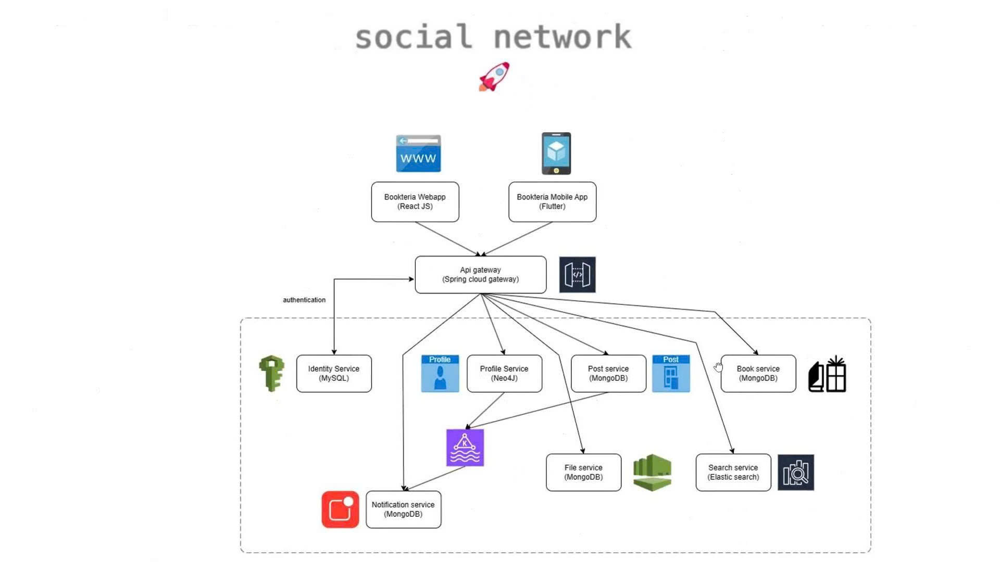

# 📚 Book - Dự Án Demo Microservices

> **Dự Án Demo Toàn Diện Về Kiến Trúc Microservices**  
> Minh họa triển khai độc lập, khả năng mở rộng và tính phục hồi của microservices



---


## 🎯 Giới Thiệu

**Book** là một dự án demo về kiến trúc **microservices** mô phỏng một mạng xã hội chia sẻ sách. 

### Mục Tiêu Demo

✅ **Chứng minh tính độc lập:** Tắt 1 service → các service khác vẫn hoạt động  
✅ **Chứng minh khả năng mở rộng:** Cập nhật/rebuild 1 service mà không ảnh hưởng toàn hệ thống  
✅ **Chứng minh tính phục hồi:** Các service tự động khởi động lại khi bị crash  
✅ **Chứng minh khả năng giao tiếp:** Các service giao tiếp qua mạng & hàng đợi tin nhắn  

---

## 🏗️ Kiến Trúc Hệ Thống

### Sơ Đồ Tổng Quát

```
┌─────────────────────────────────────────────────────┐
│           Frontend (React Web App)                  │
│              Port: 3000                             │
└────────────────────┬────────────────────────────────┘
                     │ HTTP
┌────────────────────▼────────────────────────────────┐
│         API Gateway (Spring Cloud Gateway)          │
│              Port: 8888                             │
│  (Định tuyến, Cân bằng tải, Giới hạn tốc độ)        │
└──────┬──────────┬─────────┬──────────┬──────────────┘
       │          │         │          │
   HTTP│      HTTP│    HTTP │      HTTP│
       │          │         │          │
   ┌───▼────┐  ┌───▼───┐  ┌──▼───┐  ┌──▼────┐
   │IDENTITY│  │PROFILE│  │POST  │  │ FILE  │
   │:8080   │  │:8081  │  │:8081 │  │ :8084 │
   └─┬──────┘  └──┬────┘  └──┬───┘  └──┬────┘
     │            │          │         │
┌────▼────────────▼──────────▼─────────▼──────┐
│ MySQL    |    Neo4j  |  MongoDB  |  MongoDB │
└─────────────────────────────────────────────┘
```
---


## 📊 Luồng Giao Tiếp Giữa Các Service

### Đồng bộ (HTTP/REST)
```
Web App → API Gateway → Services → Services (Gọi giữa các service)
```

### Bất đồng bộ (Hướng sự kiện)
```
Service A → Kafka Topic → Service B (Xuất bản/Đăng ký sự kiện)
```

### Ví dụ: Luồng Đăng Ký Người Dùng
```
1. Web App → API Gateway → Identity Service (POST /register)
2. Identity Service → MySQL (Lưu người dùng)
3. Identity Service → Kafka Topic (Sự kiện UserCreated)
4. Profile Service → Kafka (Lắng nghe UserCreated)
5. Profile Service → Neo4j (Tạo node người dùng)
6. Notification Service → Kafka (Lắng nghe UserCreated)
7. Notification Service → Gửi email chào mừng
```

---

## 🔧 Các Lệnh Thường Sử Dụng

```powershell
# Xem & Giám sát
docker-compose ps                    # Xem trạng thái tất cả services
docker-compose logs -f               # Xem logs thời gian thực (tất cả)
docker-compose logs -f identity-service  # Logs của 1 service

# Quản lý Services
docker-compose up -d                 # Khởi động tất cả services
docker-compose down                  # Dừng tất cả services
docker-compose stop identity-service # Dừng 1 service
docker-compose restart identity-service  # Khởi động lại 1 service

# Build & Cập nhật
docker-compose build                 # Build tất cả images
docker-compose build identity-service    # Build 1 service
docker-compose up -d identity-service    # Khởi động lại với image mới

# Dọn dẹp
docker-compose down -v               # Dừng & xóa volumes
docker image prune -a                # Xóa images không dùng
docker volume prune                  # Xóa volumes không dùng
```

---

## 📁 Cấu Trúc Dự Án

```
Book/
├── api-gateway/              # API Gateway (Spring Cloud Gateway)
│   ├── src/
│   ├── Dockerfile
│   ├── pom.xml
│   └── application-docker.yaml
├── identity-service/         # Xác thực & Quản lý người dùng
│   ├── src/
│   ├── Dockerfile
│   ├── pom.xml
│   └── application-docker.yaml
├── profile-service/          # Hồ sơ người dùng (Neo4j)
├── post-service/             # Bài viết & Tính năng xã hội
├── file-service/             # Tải lên/xuống tệp
├── chat-service/             # Trò chuyện (MongoDB)
├── notification-service/     # Thông báo
├── web-app/                  # React Frontend
├── docker-compose.yml        # Cấu hình Docker Compose
├── DOCKER_DEPLOYMENT_GUIDE.md    # Hướng dẫn triển khai chi tiết
├── DEMO_SCENARIOS.md         # Scripts & kịch bản demo
├── .env.example              # Mẫu biến môi trường
├── manage.bat                # Script quản lý Windows
└── README.md                 # File này
```
---
## 🎬 Demo Flow

```
1. Show Architecture (README.md + Architecture.jpg)
   ↓
2. Explain Services (8 microservices)
   ↓
3. Start Docker Compose (QUICK_START.md)
   ↓
4. Verify All Services Running (docker-compose ps)
   ↓
5. Demo Independence (DEMO_SCENARIOS.md)
   - Stop service A → B,C,D still run
   - Update service A → restart → B,C,D unaffected
   - Crash service A → auto-restart
   ↓
6. Show APIs (API_TESTING_GUIDE.md)
   ↓
7. Discuss Production (KUBERNETES_GUIDE.md)
   ↓
8. Q&A
```

---

## 🎓 Các Điểm Chính

### Lợi Ích Của Microservices Được Minh Họa

1. **Tính độc lập:** Mỗi service triển khai riêng biệt
2. **Khả năng mở rộng:** Mở rộng từng service theo nhu cầu
3. **Linh hoạt công nghệ:** Mỗi service sử dụng công nghệ khác nhau
4. **Cách ly lỗi:** Service bị crash không ảnh hưởng các service khác
5. **Tự chủ của nhóm:** Các nhóm có thể làm việc độc lập
6. **Phát triển nhanh:** Triển khai thay đổi nhanh chóng

### Cách Dự Án Này Minh Họa Các Khái Niệm

- **Tính độc lập của Service:** Sử dụng `docker-compose stop` một service
- **Giao tiếp:** Các service giao tiếp qua API Gateway & Kafka
- **Khả năng phục hồi:** Các service tự động khởi động lại với `restart: unless-stopped`
- **Khả năng mở rộng:** Có thể rebuild/khởi động lại từng service riêng lẻ
- **Đóng gói container:** Mỗi service trong container Docker riêng biệt
- **Điều phối:** Docker Compose quản lý ứng dụng đa container
---

**Sẵn sàng triển khai? Bắt đầu thôi! 🚀**

**Khởi động:**
```powershell
cd D:\UIT\Co_So_Ha_Tang\Book
docker-compose build
docker-compose up -d
docker-compose ps
```